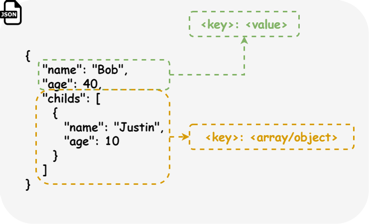

# [原创] minijson： 手搓一个c语言json库。

最近的业余时间，我在用c语言写一个国际象棋的小游戏，
在过程中，我想要将我的游戏状态保存到硬盘里，以供下一次读取。
但是呢用什么方式保存游戏状态呢，我打算使用json格式，
不在乎开发速度，因此需要一个c语言的json库，因为是业余项目，因此我先打算自己手搓一个json库，
来实现结构转json文件，以及从json文件转结构体。
项目：https://github.com/linzhi555/minijson


先介绍一下json格式，json是一种数据交换格式，也是一种标记语言
在我看来json是一种很麻烦的标记语言，key值一定要双引号，不能有注释，不能有多余的逗号。
但是json有一个特点，它真的太流行了,到处都用json格式，什么语言都用，
甚至vscode还用这个json当配置文件。。。。



json格式其实非常简单，总共6种类型,他有4种原子类型，null类型，bool类型，Num类型，String类型。
以及2种复合类型，Array和Object。
Array 是数组类型，其中可以包括任意类型，Object 是对象类型，本质就是map，包含一系列的键值对， 键是字符串，值是可以使任意类型,包括可以里一个Object。
这里有一点的事，由于个人不喜欢Object这个名字，因为Json已经不是Javascript专有的格式了！
因此在我的库里我就叫它map! 因为它就是键值对的组合!


由于有复合类型的存在，我们分析一个Json文件最终会得到一颗树。
Json库的任务就是将一段字符串转换成一个Json 节点树。
但其实直接处理字符串是很麻烦的！ 因为有格式问题!
比如有两个json，
"{"a":11}" 以及 "{ "a" :11   }",这两个字符串是不同的，但其实的含义是一样的，只是空格不同。

因此一切开始前我们需要先了解词法分析这一步，词法分析我个人理解其为是一种断句分析，
在词法分析后呢，这两个字符串就被统一的转换为了 { , "a" , ":" , 11 , }这5个Token，
词法分析将复杂的字符串提取出了核心信息。
并且呢token是有类型的，11是数字类型token，“a”是字符类型。
将字符流转换为token流的工具是lexer，有了lexer方便多了！
就不用在后面的语法解析中处理什么空格啊，字符串解析啊，数字解析之类等繁琐的事情。

在本项目中，lexer是这么一个类，我们使用lexer_peek，就可以获取流最前方的token。
使用lexer_next就可以让它移动到下一个token。我们的任务是给你一个这么一个token流，
消耗它，把它分析成一个json的数据类型，当数据结构构造完成的时候，这个流应该也读取完毕了。

为了完成这个任务，我可以设计形如parse_Type(Type*, Lexer* , Error*,)函数的函数。XXX是类型,对应json的6种数据类型。
parse家族的函数可以消耗lexer，来解析一个初始化一个Type类型。 并且有一个重要的原则，
如果parse分析失败了，应该恢复lexer的原始状态！因为你parse失败了那就不应该干扰其他的parse尝试。
这样的函数有好几个，

parse_map, 尝试消耗lexer形成一个map

parse_map_fields, 尝试消耗lexer形成一个map的字段

parse_array, 尝试消耗lexer形成一个array

parse_value, 尝试消耗lexer形成一个任意类型的jsong数据类型，包括null，bool，array...

这样的设计原因是，这些parse函数不是孤立的，它们是互相引用的，根据逻辑形成递归结构。
比如我们可以用parse_map来消耗lexer形成一个map，两个括号比较好分析，但是中间有N个字段，
我们可以调用parse_map_fields, 而parse_map_fields又可以使用parse_value，
我们只要照着语法来使用调用就好了。

map的语法是 { + N*map_fields  + }
则parse_map的伪代码可以是

```
int parse_map(map,lexer,err){
    如果 lexer_peek() 不是 { 那么 解析失败

    while(true){
        如果 parse_map_filed(map,lexer) 失败{
            结束循环
        }
    }

    如果 lexer_peek() 不是 } 那么 解析失败
}
```

同样的map_field的语法是 map_field = key + : + value
其中解析value，就稍微复杂了，
因为一个value是可以是多类型,value的语法是
value = null 或 num 或 string 或 bool 或 array 或 map

那么该怎么用代码实现这个逻辑呢，
```
int parse_value(value,lexer){
    if parse_null(value,lexer) 成功 那么 解析成功
    if parse_bool(value,lexer) 成功 那么 解析成功
    if parse_num(value,lexer) 成功 那么 解析成功
    if parse_string(value,lexer) 成功 那么 解析成功
    if parse_array(value,lexer) 成功 那么 解析成功
    if parse_map(value,lexer) 成功 那么 解析成功

    解析失败
}
```
如果语法中有或逻辑，那么我们可以一个个类型试过去，只要有一种类型成功，那么解析就成功。
